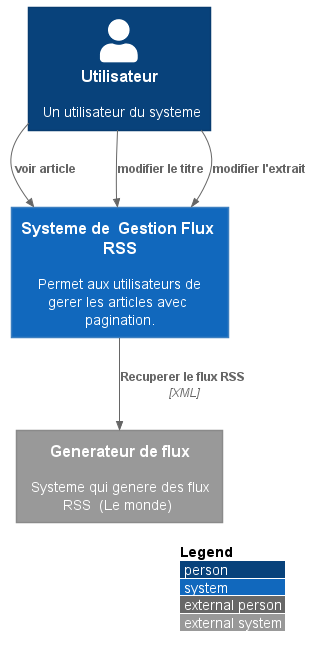
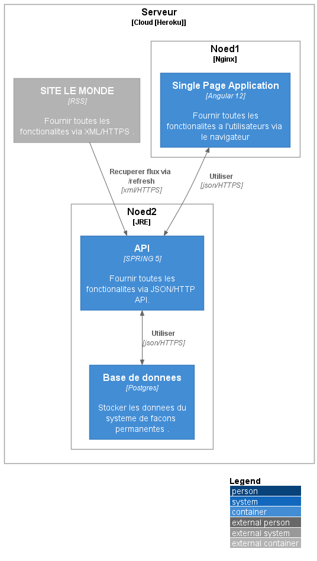

# mini_rss_reader_spring

#lien du projet
- https://mini-rss-api.herokuapp.com/
 
# On a trois APIS

##  Verifier status du serveur 

-[https://mini-rss-api.herokuapp.com/api/v1/rss/status](https://mini-rss-api.herokuapp.com/api/v1/rss/status)

## charger le flux RSS (uniquement les nouveaux articles )  

-[https://mini-rss-api.herokuapp.com/api/v1/rss/refresh](https://mini-rss-api.herokuapp.com/api/v1/rss/refresh)

## lister les articles 

-[https://mini-rss-api.herokuapp.com/api/v1/rss/items](https://mini-rss-api.herokuapp.com/api/v1/rss/items)

## Lancer le projet

### Backend  (SPRING)
1- Option 1 : passser par la release
- Telecharger le fichier :  https://github.com/coundia/mini_rss_reader_spring/releases/download/v1.1/mini_rss_reader_spring-v1.1.jar
- Configurer le JRE de JAVA
- java -jar mini_rss_reader_spring-v1.1.jar
2- Option 2 : passer maven
- Backend (spring)
- mvn spring-boot:run

### front end (angular)
1- Option 1 : passser par la release
- Telecharger le dist : https://github.com/coundia/mini-rss-reader/releases/download/v1.1/distV1.1.zip
- decompresser le 
- SI vous n'avez de  serveur Apache ou NGINX 
-  - npm install --global http-server
-  - cd distV1 
-  --  http-server -o

2- Option 2 : passer par npm 
- npm  install
- ng serve

## Lien de test
- front end
- https://mini-rss-reader.herokuapp.com/

- Backend
- https://mini-rss-api.herokuapp.com/api/v1/rss/items
- https://mini-rss-api.herokuapp.com/api/v1/rss/refresh
- https://mini-rss-api.herokuapp.com/api/v1/rss/status

## MODEL C4

#Context

## Architecture

by coundia
